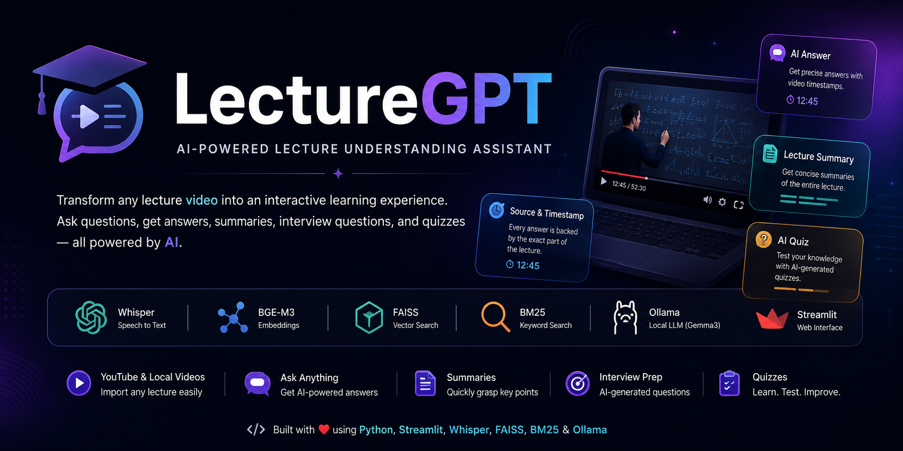

<p align="center">
  
</p>

<h1 align="center">🎓 LectureGPT</h1>

<p align="center">
AI-Powered Lecture Understanding Assistant
</p>

> **AI-Powered Lecture Understanding Assistant**

Transform educational video lectures into an interactive learning experience using Retrieval-Augmented Generation (RAG), speech-to-text transcription, semantic search, and a local Large Language Model.


---

##   📖 Overview

LectureGPT is an AI-powered learning assistant that helps students understand video lectures more effectively.

Instead of watching an entire lecture again, users can ask questions in natural language and instantly receive accurate answers extracted from the lecture along with timestamps, summaries, interview questions, and AI-generated quizzes.

The project works completely on local AI models using Ollama, making it privacy-friendly and cost-effective.

---

## ✨ Features

- 🎥 Import YouTube videos or local lecture videos
- 🎙️ Automatic speech transcription using Whisper
- 🧩 Intelligent chunking of lecture transcripts
- 🔎 Hybrid Retrieval (FAISS + BM25)
- 🤖 AI-powered Question Answering using Local LLM
- ⏱️ Source Video with Timestamp
- 📝 Lecture Summary Generation
- 🎯 Interview Question Generation
- 🧠 AI Quiz Generation
- 📄 Export Answers to TXT and PDF
- 📚 Lecture Library Management
- 💻 Modern Streamlit UI

---

## 🏗️ System Architecture

```
Video Input
      │
      ▼
Audio Extraction
      │
      ▼
Whisper Transcription
      │
      ▼
Transcript Chunking
      │
      ▼
Embeddings Generation (BGE-M3)
      │
      ▼
FAISS + BM25 Retrieval
      │
      ▼
Gemma3 (Ollama)
      │
      ▼
Answer Generation
      │
      ▼
Summary • Quiz • Interview Questions
```

---

## 🛠️ Tech Stack

| Category | Technology |
|----------|------------|
| Language | Python |
| UI | Streamlit |
| Speech-to-Text | Whisper |
| LLM | Gemma3 (Ollama) |
| Embeddings | BGE-M3 |
| Retrieval | FAISS + BM25 |
| PDF Export | ReportLab |
| Video Processing | FFmpeg |
| Data Storage | JSON |

---

## 📂 Project Structure

```text
LectureGPT/
│
├── app.py
├── main_pipeline.py
├── pipeline/
├── data/
├── audio/
├── assets/
├── requirements.txt
└── README.md
```

---

## 🚀 Installation

### Clone Repository

```bash
git clone https://github.com/PranavGundap/LectureGPT.git
```

### Go to Project

```bash
cd LectureGPT
```

### Install Requirements

```bash
pip install -r requirements.txt
```

### Run

```bash
streamlit run app.py
```

---

## 📸 Screenshots

(Add your screenshots here)

- Home Page
- Lecture Library
- AI Answer
- Lecture Summary
- Quiz Generation
- Quiz Result

---

## 🎥 Demo Video

(Add GitHub video link here)

---

## 📝 Demo Video Note

The demo video has been edited to remove long AI processing and waiting periods for a smoother viewing experience. Actual processing time depends on lecture length and system hardware.

---

## 🔮 Future Enhancements

- Multi-language support
- Voice-based interaction
- Multi-document RAG
- Cloud deployment
- User authentication
- Personalized learning analytics

---

## 👨‍💻 Author

**Pranav Gundap**

AI Engineering Student

GitHub:
https://github.com/PranavGundap

---

## 📄 License

This project is intended for educational and portfolio purposes.

## ⭐ Support

If you found this project useful, consider giving it a ⭐ on GitHub.